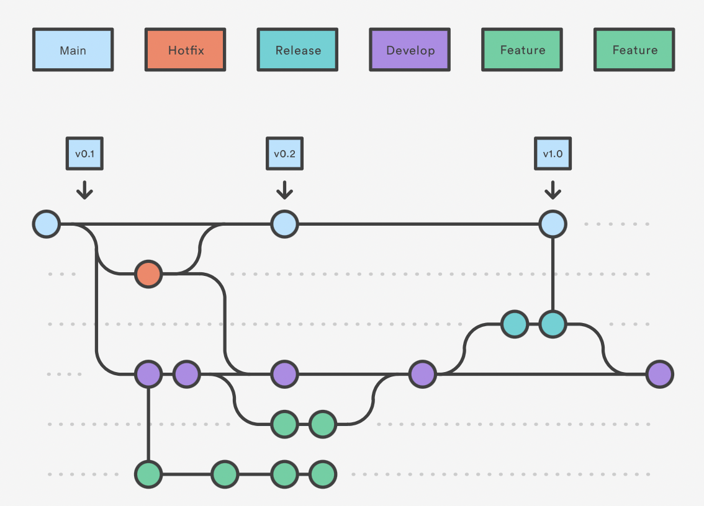

# GoodFood - web
## Angular

This project was generated with [Angular CLI](https://github.com/angular/angular-cli) version 13.2.6.

## Development server

Run `ng serve` (or `ng serve --open` or `ng serve -o` or `npm start`) for a dev server. Navigate to `http://localhost:4200/`. The app will automatically reload if you change any of the source files.

## Code scaffolding

Run `ng generate component <component-name>` to generate a new component. You can also use `ng generate directive|pipe|service|class|guard|interface|enum|module`.

## Build

Run `ng build` to build the project. The build artifacts will be stored in the `dist/` directory.

## Running unit tests

Run `ng test` to execute the unit tests via [Karma](https://karma-runner.github.io).

## Running end-to-end tests

Run `ng e2e` to execute the end-to-end tests via a platform of your choice. To use this command, you need to first add a package that implements end-to-end testing capabilities.

## Further help

To get more help on the Angular CLI use `ng help` or go check out the [Angular CLI Overview and Command Reference](https://angular.io/cli) page.

## Exit

Run `ctrl c` to exit a dev server.

# Versions

- Nodejs : 16.13.02
- Angular : 13.2.6
- PrimeNG : 13.3.2

# Installation

### [PrimeNG](https://primefaces.org/primeng/showcase/#setup)

### [primeicons](https://www.npmjs.com/package/primeicons)

```sh
npm install primeng --save
npm install primeicons --save
```

in `angular.json > Styles` we will add also

```sh
node_modules/primeicons/primeicons.css
node_modules/primeng/resources/themes/lara-light-indigo/theme.css
node_modules/primeng/resources/primeng.min.css
```

> There is more than 33 themes and we can choose between them.

# Getting for first time

### git clone [GOODFOOD-2.0A](https://github.com/ZDubeau/GOODFOOD-2.0A.git)

### npm install

## Dockerfile

- [Dockerfile reference](https://docs.docker.com/engine/reference/builder/#run)
- [Dockerize example](https://www.indellient.com/blog/how-to-dockerize-an-angular-application-with-nginx/)

Create image in Docker

```sh
docker build -t goodfood-web .
```

Check :

```sh
docker images
```

```sh
REPOSITORY TAG IMAGE ID CREATED SIZE

goodfood-web latest  28cb65260f81 11 hours ago  24.2MB
```

Après build on va créer le conteneur docker :

```sh
docker run -d -p 4200:4200 --name GoodFood-web goodfood-web
```

See container details :

```sh
docker ps
```

```sh
CONTAINER ID IMAGE COMMAND CREATED STATUS PORTS NAMES
f10f652d3da9 goodfood-web "nginx -g 'daemon of…" 16 minutes ago Up 16 minutes 0.0.0.0:8181->80/tcp GoodFood-web
```

**_http://localhost:4200/_**

## Compodoc

Compodoc is a documentation tool for Angular applications. It generates a static documentation of your application.

### Installation

- Global installation

```sh
npm install -g @compodoc/compodoc
```

- Local installation

```sh
ng add @compodoc/compodoc
```

- Configuration

```sh
npx compodoc -p tsconfig.doc.json --theme material
```

Run script :

```sh
npm run compodoc
./node_modules/.bin/compodoc -s -r 4201
```

### docker compose

```sh
docker compose up --build -d
```

# GITFLOW

[Tutorial Git flow workflow](https://www.atlassian.com/git/tutorials/comparing-workflows/gitflow-workflow)



Sonar Status : [](https://sonarcloud.io/summary/new_code?id=GoodFood-Cesi-2022_GOODFOOD-2.0A)

<!-- [](https://sonarcloud.io/summary/new_code?id=GoodFood-Cesi-2022_GOODFOOD-2.0A)

[](https://sonarcloud.io/summary/new_code?id=GoodFood-Cesi-2022_GOODFOOD-2.0A)

[](https://sonarcloud.io/summary/new_code?id=GoodFood-Cesi-2022_GOODFOOD-2.0A)

[](https://sonarcloud.io/summary/new_code?id=GoodFood-Cesi-2022_GOODFOOD-2.0A)

[](https://sonarcloud.io/summary/new_code?id=GoodFood-Cesi-2022_GOODFOOD-2.0A) -->